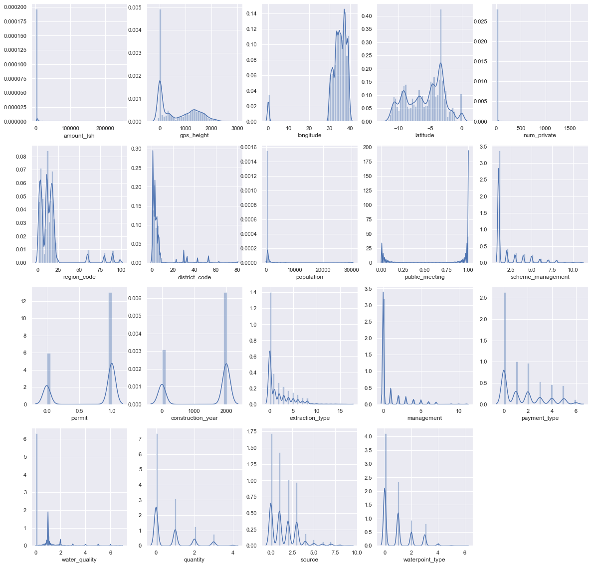

# Week 9 Project  
[`Pump-it-Up-Data-Mining-the-Water-Table`]

# Goal
The goal of this project is to predict which pumps are functional ( or need some repairs), which are not funtional. KNN, Decision Tree and Random Forest are applied in this project. According to accuracy_score and F1_score, Random Forest model is selected as the final model. 

# Data Cleaning  
In order to obtian the best prediction, I removed some columns which contian missing data more than 20%. Then remove rows which contians missing values.

# Distribution of Target and Features 

* Distribution of Target

* Distribution of Features

* Feature Selection

# Feature Engineering
-Train Test Split
- Oversampling
- Data Standardization (StandardScaler)
# Models
- KNN         
- Random Forest
- Decision Tree
# Conclusion

- Comparing KNN , Random Forest and Decision Tree models, Random Forest model gave highest accuracy score and F score.  
- According to Random Forest model top 5 important features are :
 *1.'longitude' 
 *2.'latitude'
 *3.'quantity'
 *4.'gps_height'
 *5.'waterpoint_type'
 
 
     
- Source website: https://www.drivendata.org/competitions/7/pump-it-up-data-mining-the-water-table/data/
- Presentation: 
